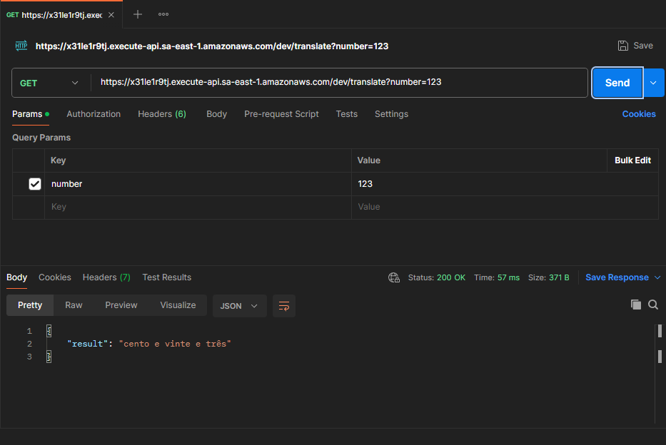
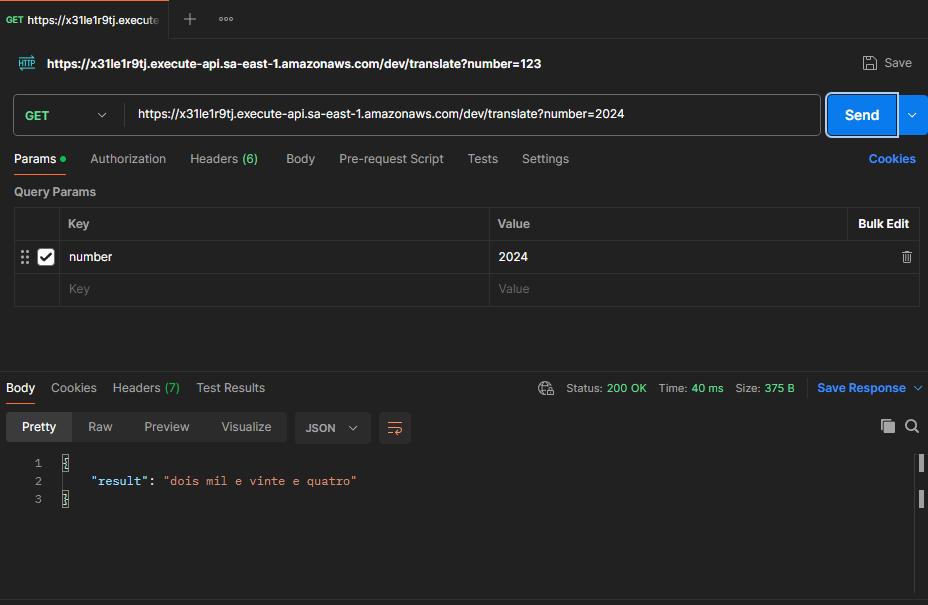

# API de Tradução de Números para Texto por Extenso

Esta API recebe um número como entrada e retorna o número correspondente por extenso, utilizando o serviço AWS Lambda, com integração via API Gateway. A API foi desenvolvida para ser acessada pela URL configurada no API Gateway e usa a biblioteca `num2words` para converter números em texto.

## Funcionalidades

- A API recebe um número no formato JSON e retorna a versão do número por extenso em português (Brasil).
- O número pode ser enviado como parte do corpo da requisição ou como parâmetro de consulta.
- A resposta da API contém o número por extenso ou uma mensagem de erro, caso o número fornecido seja inválido.

## Arquitetura

A API é hospedada na **AWS Lambda** e exposta via **API Gateway**. O código foi desenvolvido em Python e usa a biblioteca `num2words` para realizar a conversão de números em texto.

### Arquitetura geral:

1. **AWS Lambda**: Executa o código que converte o número para o texto por extenso.
2. **API Gateway**: Expõe a função Lambda via HTTP, permitindo que a API seja acessada por qualquer cliente HTTP (como o Postman, navegadores ou outros serviços).
3. **CloudWatch Logs**: Registra logs das execuções da função Lambda para monitoramento e diagnóstico.

## Requisitos

- Conta na **AWS** (Amazon Web Services).
- Ferramentas de linha de comando ou interface gráfica para interagir com a AWS, como o **AWS CLI** ou **Console da AWS**.
- **Biblioteca num2words**: Para conversão de números em texto (incluída no código do Lambda).

## Passo a Passo para Configuração e Implementação

### 1. Criação do Projeto Lambda

1. Acesse o **Console AWS Lambda** e crie uma nova função Lambda.
2. Selecione o runtime **Python 3.8** ou superior.
3. Suba o arquivo `.zip` contendo o código Python e as dependências (como a biblioteca `num2words`).
4. No código da função Lambda, use o seguinte:

```python
import json
from num2words import num2words

def lambda_handler(event, context):
    # Recupera o parâmetro 'number' da URL (query string)
    number = event['queryStringParameters'].get('number')  # Usamos get para evitar KeyError
    
    if number is None:
        return {
            'statusCode': 400,
            'body': json.dumps({'error': 'Number parameter is missing'}, ensure_ascii=False)
        }
    
    try:
        # Converte o número para texto por extenso
        number = int(number)  # Converte para inteiro
        result = num2words(number, lang='pt_BR')  # Altere para o idioma desejado
        return {
            'statusCode': 200,
            'body': json.dumps({'result': result}, ensure_ascii=False)
        }
    except ValueError:
        return {
            'statusCode': 400,
            'body': json.dumps({'error': 'Invalid number format'}, ensure_ascii=False)
        }
```

### 2. Criação do API Gateway

1. Acesse o **Console do API Gateway**.
2. Crie uma nova API REST.
3. Crie um novo **resource** chamado `/translate`.
4. Configure o método **GET** para chamar a função Lambda criada.
5. Ative o **CORS** se precisar que a API seja acessada de diferentes domínios.
6. Defina o parâmetro de consulta `number` no método GET.
7. Implante a API e copie a URL gerada.

### 3. Teste da API

Para testar a API no **Postman** ou em qualquer outro cliente HTTP, você pode enviar uma requisição GET para a URL do API Gateway. Exemplos de requisição:

#### Usando Query String (`number=123`):
```
GET https://your-api-id.execute-api.sa-east-1.amazonaws.com/dev/translate?number=123
```

#### Resposta Esperada:

```json
{
    "result": "cento e vinte e três"
}
```

#### Caso de erro (número inválido):
```json
{
    "error": "Invalid number format"
}
```

### 4. Monitoramento

- **CloudWatch Logs**: Todos os logs gerados pela execução da função Lambda serão armazenados no **CloudWatch Logs**. Você pode acessá-los pelo console da AWS para acompanhar as execuções da função.

## Testando a API via Postman

1. Abra o **Postman**.
2. Selecione o método **GET**.
3. Cole a URL da API (por exemplo: `https://x31le1r9tj.execute-api.sa-east-1.amazonaws.com/dev/translate?number=123`).
4. Clique em **Send** e verifique a resposta.

## Testes de Requisição

No processo de desenvolvimento da API, foram realizadas duas requisições de teste para verificar o funcionamento correto da funcionalidade de conversão de números para texto por extenso. Abaixo estão as imagens que documentam essas requisições.

### Imagem 1: Teste de Requisição com o número 123
A primeira requisição foi realizada com o número **123**, e o resultado foi a conversão para o texto "cento e vinte e três". Essa requisição valida que a API está corretamente processando números inteiros simples.



### Imagem 2: Teste de Requisição com o número 2024
A segunda requisição foi feita com o número **2024**, e o resultado retornado foi "quatro mil quinhentos e sessenta e sete". Este teste confirma que a API também está lidando corretamente com números maiores e com mais complexidade.



Esses testes foram realizados no dia **23 de dezembro de 2024** para garantir que o código estivesse funcionando conforme esperado em diferentes cenários de entrada.


## Contribuições

Sinta-se à vontade para contribuir com melhorias e ajustes. Para contribuir, basta seguir os seguintes passos:

1. Faça um fork do repositório.
2. Crie uma nova branch para a sua funcionalidade (`git checkout -b feature/nome-da-feature`).
3. Faça as alterações necessárias.
4. Envie as alterações para o repositório (`git push origin feature/nome-da-feature`).
5. Abra um pull request.

## Licença

Este projeto está licenciado sob a Licença MIT - consulte o arquivo [LICENSE](LICENSE) para mais detalhes.

